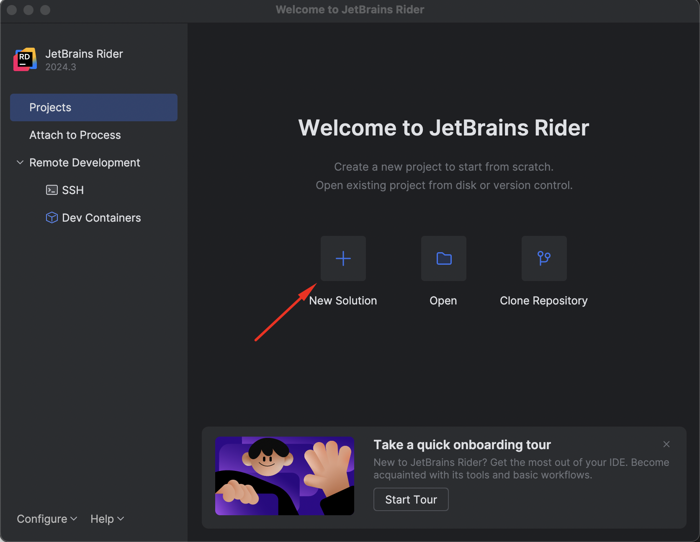
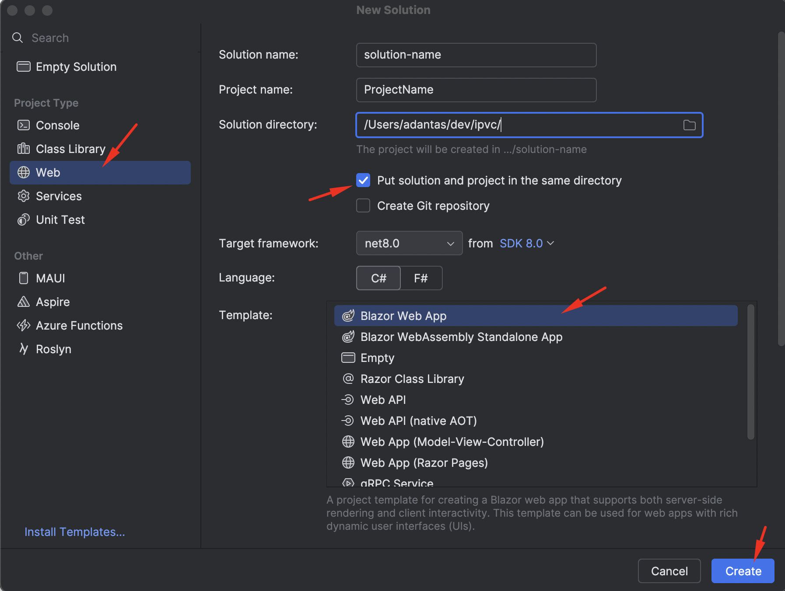
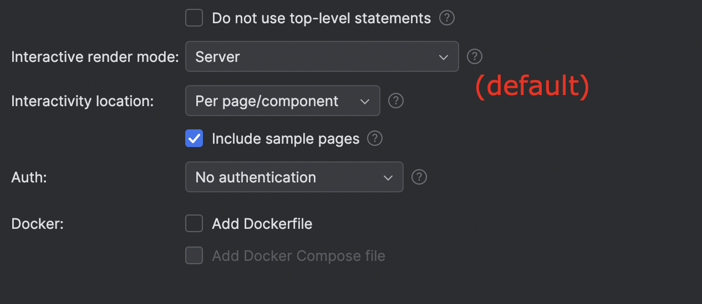

# Configuração de Projeto Blazor C# com Entity Framework Core e PostgreSQL

- [Inicializar projeto com o Rider](#inicializar-projeto-com-o-rider)
- [Configurar .gitignore](#configurar-gitignore)
- [Instalar as Dependências](#instalar-as-dependências)
- [Criar o Modelo de Dados](#criar-o-modelo-de-dados)
- [Configurar o Contexto da Base de Dados](#configurar-o-contexto-da-base-de-dados)
- [Registar o Contexto de Base de Dados](#registar-o-contexto-de-base-de-dados)
- [Configurar a String de Ligação da Base de Dados](#configurar-a-string-de-ligação-da-base-de-dados)
- [Criar a Base de Dados](#criar-a-base-de-dados)
- [Aplicar as Migrações](#aplicar-as-migrações)
- [Criar os Controllers](#criar-os-controllers)
- [Utilizar o Controller no Cliente](#utilizar-o-controller-no-cliente)

## Inicializar projeto com o Rider

Para criar um novo projeto Blazor no Rider:

1. "New Solution"
2. Project Type: Web
3. Template: Blazor Web App (interactive render mode: Server)

Nota: Em princípio isto é o mesmo que fazer `dotnet new blazor --interactivity Server`





## Configurar gitignore

É preciso colocar um ficheiro `.gitignore` adequado para projetos C#/Blazor, na raiz do working copy do repositório:

Você pode usar o template oficial do GitHub para C#:
[.gitignore para C#](https://github.com/oktadev/blazor-example/blob/master/.gitignore)

## Instalar as Dependências

Primeiro, é preciso instalar os pacotes NuGet para o Entity Framework Core e PostgreSQL:

```bash
dotnet add package Microsoft.EntityFrameworkCore
dotnet add package Npgsql.EntityFrameworkCore.PostgreSQL
dotnet add package Microsoft.EntityFrameworkCore.Tools
dotnet add package Microsoft.EntityFrameworkCore.Design
```

## Criar o Modelo de Dados

Depois é preciso criar pelo menos um Model para experimentar -- nota: não precisam de criar tudo de uma vez, alias, é muito provavel encontrarem problemas se tentarem meter o modelo todo de uma vez, vão adicionando classes. Por exemplo:

```csharp
public class Artist
{
    [Key]
    public int Id { get; set; }
    public string Name { get; set; }
    public string Bio { get; set; }
    public DateTime BirthDate { get; set; }
}
```

## Configurar o Contexto da Base de Dados

É preciso uma classe `ApplicationDbContext` que herde de `DbContext`, esta classe é o que "liga" o código à base de dados:

```csharp
using Microsoft.EntityFrameworkCore;

public class ApplicationDbContext : DbContext
{
    public ApplicationDbContext(DbContextOptions<ApplicationDbContext> options)
        : base(options)
    {
    }
    
    public DbSet<Artist> Artists { get; set; }
    
    protected override void OnModelCreating(ModelBuilder modelBuilder)
    {
        base.OnModelCreating(modelBuilder);
        
        // Configurações adicionais do modelo podem ser adicionadas aqui
    }
}
```

## Registar o Contexto de Base de Dados

A seguir é preciso configurar a classe que acabamos de criar (ApplicationDbContext) no `Program.cs`, para que o nosso programa "saiba" que ela existe:

```csharp
builder.Services.AddDbContext<ApplicationDbContext>(options =>
    options.UseNpgsql(builder.Configuration.GetConnectionString("DefaultConnection"))
);
```

## Configurar a String de Ligação da Base de Dados

Em cima fizemos referência a 'DefaultConnection', isso é uma string que configura o acesso à base de dados que tem de estar no `appsettings.json`:

```json
{
  "ConnectionStrings": {
    "DefaultConnection": "Host=localhost;Database=postgres;Username=postgres;Password=postgres"
  },
  "Logging": {
    "LogLevel": {
      "Default": "Information",
      "Microsoft.AspNetCore": "Warning"
    }
  },
  "AllowedHosts": "*"
}
```

## Criar a Base de Dados

Se não tens, instala o PostgreSQL [https://www.postgresql.org/download/](https://www.postgresql.org/download/) e cria uma base de dados nova. Alternativamente podes usar o docker para correr a base de dados (é mais complexo e desnecessário nesta fase, mas funciona em qualquer computador da mesma maneira).

## Aplicar as Migrações

Agora que, da parte do código, já está tudo pronto para ligar à base de dados, é preciso converter o código (os nossos Models) em tables de base de dados:

```bash
dotnet ef migrations add InitialCreate
dotnet ef database update
```

## Criar os Controllers

### Criar o Controller

Cria um controller, os controllers é o que compõem a API, nós pedimos coisas aos controllers e eles dão/fazem:

```csharp
using Microsoft.AspNetCore.Mvc;
using Microsoft.EntityFrameworkCore;

[Route("api/[controller]")]
[ApiController]
public class ArtistController : ControllerBase
{
    private readonly ApplicationDbContext _context;

    public ArtistController(ApplicationDbContext context)
    {
        _context = context;
    }

    [HttpGet]
    public async Task<ActionResult<IEnumerable<Artist>>> GetArtists()
    {
        return await _context.Artists.ToListAsync();
    }

    [HttpGet("{id}")]
    public async Task<ActionResult<Artist>> GetArtist(int id)
    {
        var artist = await _context.Artists.FindAsync(id);

        if (artist == null)
        {
            return NotFound();
        }

        return artist;
    }
}
```

### Instalar e Configurar o Swagger

O Swagger permite testar os controllers sem ter de os ligar ao frontend, meter esta nuget package:

```bash
dotnet add package Swashbuckle.AspNetCore
```

É preciso injetar o controller no `Program.cs`, no builder:

```csharp
// Adicionar controllers de API
builder.Services.AddControllers();

// Adicionar serviços do Swagger
builder.Services.AddEndpointsApiExplorer();
builder.Services.AddSwaggerGen(c =>
{
    c.SwaggerDoc("v1", new OpenApiInfo
    {
        Title = "Sandbox API",
        Version = "v1",
        Description = "API para a aplicação Blazor Sandbox"
    });
});
```

Na parte de baixo (na app) também:

```csharp
if (app.Environment.IsDevelopment())
{
    app.UseSwagger();
    app.UseSwaggerUI(c =>
    {
        c.SwaggerEndpoint("/swagger/v1/swagger.json", "Sandbox API V1");
    });
}

// Mapear controllers
app.MapControllers();
```

### Testar os Controllers

Agora já dá para ir ao Swagger UI (vai a `/swagger` na aplicação) ou usa o Postman ou curl:

```bash
curl -k -X 'GET' 'https://localhost:PORT/api/Artist' -H 'accept: */*'
```

## Aceder ao Controller no Cliente

### Configurar o HttpClient

Adiciona o serviço HttpClient no `Program.cs` do projeto cliente, para podermos usar esse serviço:

```csharp
builder.Services.AddHttpClient();
builder.Services.AddScoped(sp => new HttpClient { BaseAddress = new Uri("https://localhost:PORT") });
```

### Injetar o HttpClient na Página ou Componente

Agora para usar poder aceder ao controller no cliente, injeta-o no component/page:

```razor
@inject HttpClient Http
```

### Fazer o Web Request no OnInitializedAsync

```csharp
protected override async Task OnInitializedAsync()
{
    artists = await Http.GetFromJsonAsync<Artist[]>("api/Artist");
}
````